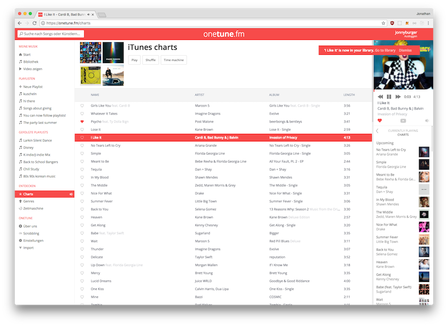

# onetune.fm

This is the source code powering onetune.fm, a web music streaming service that I wrote in 2013 when I was 17. I don't develop this service any further, but I'm making the code available for the public as a portfolio project.

This project was created in a time where the current Node.js version was 0.10 and it is super primitive, because I had never taken a programming course or cared about best practices.

There is no Babel, no Webpack, no promises, no tests, no linting. The whole frontend is written in jQuery, nonetheless you will find a surprising amount of features

## Features

- Search over 5 million tracks through iTunes
- Listen to them through automatic YouTube matching
- Build your library mixing iTunes and YouTube music
- Search artists, tracks and YouTube videos simultaneously
- Playlists
    - Support for display order, filtering, renaming, reordering
	- Share your playlists, follow other people's playlists
	- Drag and drop, context menus
	- Playlist header color matches album art
- Artist, Album and song pages
- Lyrics (broken in 2018)
- Time machine - retro charts by up to 1959
- iTunes charts
- Half-baked emote control feature onetune.fm/remote
- Play music from subreddits
- Scrobbling supported
- Full playback control support, go back to previous queues
- Full Single-Page-App navigation using jQuery

## How to install

- Clone the repository
- Install using `yarn`
- `npm run build && npm run dev`
- Open `http://localhost:5000`

## Configuration

Configuration happens through environment variables.  
Keep in mind that this was a closed-source project, so there might be many proprietary config coded in and there is not much configuration in general.

- `MONGODB`: MongoDB 2.x connection string
- `ALLOWED_USERS`: CSV of admin usernames
- `LASTFM_API_KEY`: Last.fm Api Key (for scrobbling feature)
- `LASTFM_API_SECRET`: Last.fm Api Secret (for scrobbling feature)
- `FACEBOOK_CLIENT_ID`: Facebook client ID for Facebook Login
- `FACEBOOK_CLIENT_SECRET`: Facebook client secret for Facebook Login
- `YOUTUBE_KEY`: YouTube API Key
- `NODE_ENV`: `development` / `production`

## People

- [JonnyBurger](https://jonny.io) @JonnyBurger
- [Jack Kim](https://jackk.im/) @jack7kim
- [Lawrence Lin Murata](http://lawrencemurata.com/) @lawrencelm
- [Bruno Guidolim](https://http://guidolim.com/) @bguidolim

## License

MIT © [Jonny Burger](https://jonny.io)
